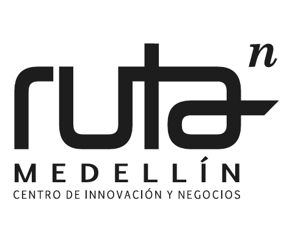
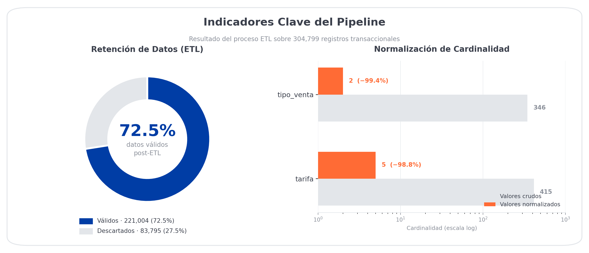

<div align="center">

# 🎡 Proyecto Parques AMVA 2024–2025
### Analítica Avanzada · Predicción de Churn · Smart Pricing

<br>

<a href="https://www.medellin.gov.co">
  
</a>
&nbsp;&nbsp;&nbsp;&nbsp;&nbsp;
<a href="https://www.medellin.gov.co/es/secretaria-privada/conglomerado-publico/entidades-del-conglomerado/ruta-n/">
  
</a>

<br><br>

[](https://www.medellin.gov.co)
[](https://www.medellin.gov.co/es/secretaria-privada/conglomerado-publico/entidades-del-conglomerado/ruta-n/)
[](https://www.medellin.gov.co/es/sala-de-prensa/noticias/ruta-n-crea-nuevo-programa-de-formacion-para-mayores-de-45-anos/)

<br>

[](https://www.python.org/)
[](https://scikit-learn.org/)
[](https://pandas.pydata.org/)
[](https://jupyter.org/)
[](LICENSE)

</div>

---

## 📋 Tabla de Contenido

- [Visión del Proyecto](#-visión-del-proyecto)
- [KPIs Técnicos](#-dashboard-de-kpis-técnicos)
- [Estructura del Repositorio](#-estructura-del-repositorio)
- [Metodología — 7 Tarjetas](#-metodología--7-tarjetas-operacionales)
- [Stack Tecnológico](#-stack-tecnológico)
- [Instalación y Uso](#-instalación-y-uso)
- [Entregables](#-entregables)
- [Autor y Licencia](#-autor-y-licencia)

---

## 🎯 Visión del Proyecto

Pipeline de ciencia de datos de **grado industrial** para la optimización de activos urbanos del
Área Metropolitana del Valle de Aburrá. El sistema integra modelos de aprendizaje no supervisado
y supervisado para transformar **304,799 registros transaccionales** en inteligencia estratégica
accionable, respondiendo directamente al reto analítico propuesto por el caso de negocio:

> *"Atraer nuevos públicos a nuestros parques, entendiendo los cambios en los comportamientos
> de asistencia y las tendencias de pérdida de usuarios en los últimos años."*

---

## 📊 Dashboard de KPIs Técnicos

| Métrica | Resultado | Estatus |
| :--- | :---: | :---: |
| **Registros brutos** | 304,799 | ✅ |
| **Registros post-ETL** | 221,004 | ✅ |
| **Usuarios únicos analizados** | 189,384 | ✅ |
| **Cardinalidad `tarifa` (cruda → limpia)** | 415 → 5 | ✅ Normalizado |
| **Cardinalidad `tipo_venta` (cruda → limpia)** | 346 → 2 | ✅ Normalizado |
| **Features del modelo** | 12 | ✅ |
| **ROC-AUC — Random Forest** | **0.7537** | ✅ Validado |
| **Umbral óptimo de descuento** | **11.92%** | ✅ Calculado |
| **Segmentos de usuario** | 4 (K-Means, 6 features) | ✅ |
| **Data Leakage detectado y excluido** | `recencia` excluida | ✅ |
| **Cobertura temporal** | Ene 2024 → Dic 2025 | ✅ |

<div align="center">
<br>

</div>

---

## 📂 Estructura del Repositorio

```
urban-parks-intelligence/
│
├── 📒 src/
│   └── analisis_parques.ipynb          ← Pipeline completo (7 tarjetas)
│
├── 📄 docs/
│   ├── Informe_Ejecutivo_Clientes.md   ← Informe para comité directivo
│   └── Propuesta_Ejecucion.md          ← Roadmap operacional
│
├── 🖼️ assets/
│   ├── logo_alcaldia.png
│   ├── logo_rutan.png
│   └── grafico_kpis.png
│
├── 📜 LICENSE
├── 🔒 .gitignore
└── 📋 README.md
```

---

## 🔬 Metodología — 7 Tarjetas Operacionales

| # | Tarjeta | Técnica | Output clave |
|:---:|:--------|:--------|:-------------|
| 1 | **ETL — Ingesta Robusta** | `pd.concat`, parseo mixto, normalización `unicodedata` | `df` con 221,004 registros limpios |
| 2 | **Ingeniería de Características** | Variables RFM, demografía, franja horaria, comportamiento de fin de semana | `df_user` con 12 features por usuario |
| 3 | **Segmentación K-Means** | StandardScaler + método del codo (6 features) | 4 segmentos etiquetados semánticamente |
| 4 | **Modelado Supervisado + Leakage** | Correlación, exclusión de `recencia`, one-hot real | Features saneadas, 2 modelos entrenados |
| 5 | **Evaluación de Modelos** | ROC-AUC, curva ROC, importancia de features | RF wins: AUC=0.7537 |
| 6 | **Smart Pricing** | Elasticidad precio-frecuencia | Umbral óptimo de descuento: 11.92% |
| 7 | **Estacionalidad y Exportación** | Serie temporal 2024 vs 2025 | `df_resultados_analisis_parques.csv` + hallazgos de capacidad |

---

## 🛠️ Stack Tecnológico

| Capa | Herramientas |
|:-----|:-------------|
| **Lenguaje** | Python 3.12 |
| **Procesamiento** | Pandas 2.x, NumPy |
| **Modelado** | Scikit-learn (KMeans, RandomForest, LogisticRegression) |
| **Visualización** | Matplotlib, Seaborn |
| **Entorno** | Jupyter Notebook / Google Colab |
| **Control de versiones** | Git + GitHub (`badolgm`) |

---

## ⚙️ Instalación y Uso

### Opción A — Local (VS Code + venv)

```bash
# 1. Clonar el repositorio
git clone https://github.com/badolgm/urban-parks-intelligence.git

# 2. Crear y activar el ambiente virtual
py -m venv venv
.\venv\Scripts\Activate.ps1          # Windows
# source venv/bin/activate           # Mac / Linux

# 3. Instalar dependencias
pip install pandas numpy matplotlib seaborn scikit-learn openpyxl jupyter

# 4. Colocar los archivos de datos en src/ junto al notebook
#    usos_parques_2024_2025.csv
#    usos_parques_2024_2025_2.csv

# 5. Abrir el notebook
jupyter notebook src/analisis_parques.ipynb
```

### Opción B — Google Colab

1. Abrir [`src/analisis_parques.ipynb`](src/analisis_parques.ipynb) en Colab.
2. El notebook detecta automáticamente el entorno y descarga los datos desde Drive.
3. Ejecutar todas las celdas en orden (`Runtime → Run all`).

---

## 📦 Entregables

| Artefacto | Descripción | Enlace |
|:----------|:------------|:------:|
| Notebook principal | Pipeline completo — 7 tarjetas | [📒 Ver](src/analisis_parques.ipynb) |
| Informe ejecutivo | Hallazgos para comité directivo (≤3 páginas) | [📄 Ver](docs/Informe_Ejecutivo_Clientes.md) |
| Propuesta de ejecución | Roadmap operacional por fases | [📋 Ver](docs/Propuesta_Ejecucion.md) |
| Licencia | MIT License | [📜 Ver](LICENSE) |

---

## 👤 Autor y Licencia

<div align="center">

**Bernardo Adolfo Gómez Montoya**  
*Data Scientist · Software Architect*  
Programa Horizontes Senior — Ruta N + Platzi · 2026

[](https://github.com/badolgm)

</div>

<br>

Distribuido bajo licencia **MIT**. Ver [`LICENSE`](LICENSE) para más información.

---

<div align="center">
<sub>Pipeline técnico alineado con el caso de negocio — Analítica Avanzada</sub>
</div>
